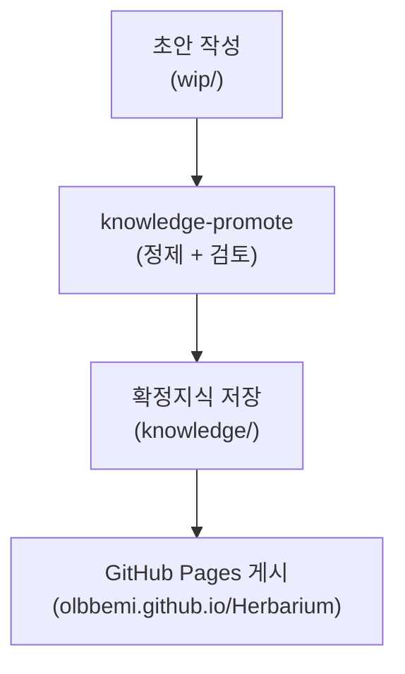

# Herbarium

확정지식 모음집. 개념을 실용 수준으로 정리해 두는 개인 지식 정원이다.
- 사이트: https://olbbemi.github.io/Herbarium/

---

## 무엇을 담는가

소프트웨어 설계, 아키텍처, 언어 기능, 라이브러리 등 실무에서 반복 참조하는 주제를 다룬다.<br>
"이해했다"에서 그치지 않고, 이후 다시 꺼내 쓸 수 있도록 핵심만 추려 정제된 형태로 남긴다.

>현재 다루는 카테고리
> - `software-architecture`
> - `software-engineering`
> - `database`
> - `language-feature`
> - `serialization`

---

## 파일 구조

```
knowledge/   확정지식. 검토를 거쳐 게시된 노트.
wip/         작업 중 초안. 아직 확정되지 않은 메모.
```

---

## 지식이 쌓이는 흐름



---

## 페이지 업데이트 방법

Jekyll 4.3 + GitHub Actions 로 `knowledge/` 디렉터리를 정적 사이트로 자동 빌드한다.<br>
`wip/` 과 메타 파일은 빌드에서 제외
