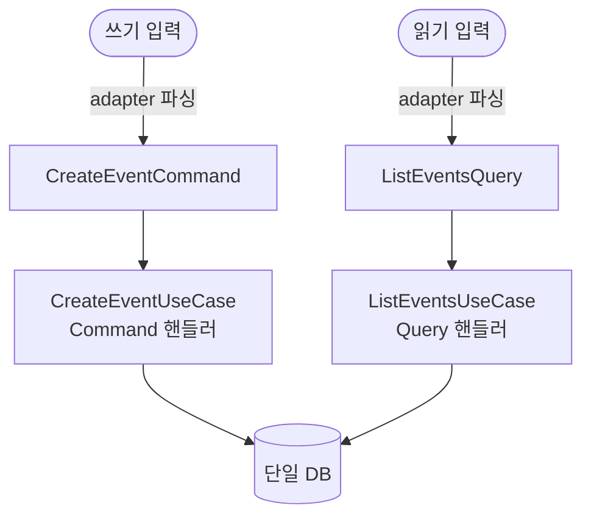

## 핵심

CQRS는 "**상태를 바꾸는 명령(Command)**과 **상태를 읽는 조회(Query)**를 책임 단위로 분리한다"는 패턴이다.

- 이름 그대로 Command/Query의 **Responsibility(책임)**를 **Segregation(분리)**한다.
- Greg Young이 Bertrand Meyer의 CQS(Command Query Separation) 원칙을 아키텍처 수준으로 확장하며 명명했다.

한 줄 핵심:

> **쓰기 경로와 읽기 경로를 같은 모델로 억지로 처리하지 말고, 둘을 별개의 책임으로 나눈다.**

중요한 것은 CQRS가 **스펙트럼**이라는 점이다. 가장 가벼운 쪽부터 가장 무거운 쪽까지 단계적으로 펼쳐진다:

- 입력을 Command/Query 객체로 나누는 수준
- read 모델과 write 모델을 따로 두는 수준
- read DB / write DB를 물리적으로 분리하고 이벤트소싱과 결합하는 수준

## 1. 뿌리 — CQS(Command Query Separation) 원칙

CQRS를 이해하려면 그 부모 격인 **CQS**부터 본다. Bertrand Meyer가 *Object-Oriented Software Construction*에서 제시한 메서드 수준 설계 원칙이다.

> 모든 메서드는 둘 중 하나여야 한다.
> - **Command**: 상태를 바꾸고, 값을 반환하지 않는다 (부수효과 O, 반환 X)
> - **Query**: 값을 반환하고, 상태를 바꾸지 않는다 (반환 O, 부수효과 X)

즉 "질문을 하는 것이 답을 바꿔서는 안 된다(Asking a question should not change the answer)".<br>
이 원칙을 지키면 어떤 메서드가 안전하게 여러 번 호출 가능한지(Query)와 신중히 다뤄야 하는지(Command)가 시그니처만으로 드러난다.

CQRS는 이 **메서드 수준 원칙을 아키텍처/객체 수준으로 끌어올린 것**이다.<br>
CQS가 "한 클래스 안에서 메서드를 두 종류로 나눈다"면, CQRS는 "쓰기를 담당하는 경로와 읽기를 담당하는 경로 자체를 다른 책임 단위(모델/객체/서비스)로 나눈다".

## 2. CQRS 스펙트럼 — "어디까지 나누느냐"

CQRS를 "쓴다/안 쓴다"의 이분법으로 보면 오해가 생긴다. 실제로는 **분리의 깊이**가 단계적으로 깊어지는 스펙트럼이다.

| 레벨 | 무엇을 분리하나 | 대표 형태 | 비용 |
|------|--------------|----------|------|
| **L0. CQS만** | 메서드를 Command/Query로 | 한 서비스 클래스 안에서 메서드 구분 | 거의 0 |
| **L1. 입력 객체 분리 (전술적 CQRS)** | UseCase 입력을 `XxxCommand` / `XxxQuery` 객체로 | Command/Query 객체 + 핸들러 분리. **모델·DB는 공유** | 낮음 |
| **L2. 모델 분리** | write 모델(도메인 Aggregate)과 read 모델(조회 전용 DTO/뷰)을 별도로 | 같은 DB, 다른 모델. read는 정규화 무시하고 조회에 최적화 | 중간 |
| **L3. 저장소 분리** | read DB와 write DB를 물리적으로 분리 | write DB -> (동기화) -> read DB(들). 보통 결과적 일관성(eventual consistency) | 높음 |
| **L4. 이벤트소싱 결합** | write 측을 Domain Event의 적분으로, read 측을 projection으로 | Event Store + Projection. CQRS+ES | 매우 높음 |

핵심: **CQRS는 L1부터 시작이지 L3/L4가 본질이 아니다.** L3/L4는 CQRS를 극단까지 밀어붙였을 때 선택적으로 따라오는 것이지 정의가 아니다. 많은 입문자가 블로그의 화려한 L3/L4 다이어그램(read DB / write DB / 메시지 버스)을 보고 "CQRS = 그 복잡한 것"이라 오해한다.

## 3. CQRS가 풀려는 문제 — "읽기와 쓰기의 요구가 다르다"

같은 도메인 모델 하나로 쓰기와 읽기를 모두 처리하면 다음 긴장이 생긴다.

- **쓰기**
  - 불변식·일관성·트랜잭션이 중요하다.
  - 정규화된 Aggregate, 도메인 규칙 검증이 필요하다.
- **읽기**
  - 화면/응답에 맞는 모양과 속도가 중요하다.
  - 여러 테이블을 조인한 평탄한 뷰, 집계, 비정규화가 유리하다.

이 둘을 하나의 모델로 동시에 만족시키려 하면 모델이 비대해지고("화면용 getter가 도메인 객체에 끼어든다"), 조회 성능을 위해 도메인 모델을 왜곡하게 된다.<br>
CQRS는 **"두 요구를 한 모델에 욱여넣지 말고 책임을 갈라라"**로 이 긴장을 해소한다.

다만 이 문제의 강도는 시스템 규모에 비례한다. 읽기/쓰기 부하가 크게 비대칭이거나(읽기 폭주), 조회 화면이 도메인 모델과 한참 다른 대규모 시스템에서 L2~L4의 가치가 커진다.<br>
**소규모 단일 사용자 도구에서는 L1의 "의도를 명시적 객체로 표현"하는 이점만 취하는 것이 합리적**이다.

## 4. 전술적 CQRS (L1, CQRS-lite)

스펙트럼의 가장 가벼운 끝만 취하는 선택이 흔하고 실용적이다. 이때 채택하는 것과 의도적으로 안 하는 것을 분명히 해두면 오해가 줄어든다.

| CQRS 요소 | L1에서 |
|----------|--------|
| 입력을 Command/Query 객체로 분리 (L1) | **채택** — UseCase가 `XxxCommand` / `XxxQuery`를 입력으로, `Result`를 반환 |
| Command 핸들러 / Query 핸들러 책임 분리 | **채택** — 액션별 UseCase로 핸들러를 나눔 |
| read 모델 / write 모델 분리 (L2) | **미채택** — 도메인 모델 하나를 읽기·쓰기가 공유 |
| read DB / write DB 물리 분리 (L3) | **미채택** — 단일 DB. 동기화·결과적 일관성 개념 없음 |
| 이벤트소싱 결합 (L4) | **미채택** — 상태를 직접 저장(current state) |

읽는 법: **CQRS의 어휘(Command/Query 객체, 핸들러 분리)는 가져오되, 인프라 수준의 분리(모델/DB/이벤트소싱)는 가져오지 않는다.** "전술적 CQRS" 또는 "CQRS-lite"라 부른다.

## 5. 왜 L1만으로도 가치가 있나

L1 수준의 가벼운 분리만으로도 실익이 분명하다.

1. **의도(intent)의 명시화**
   - `CreateEventCommand`라는 객체 자체가 "사용자가 무엇을 하려는가"를 1급 시민으로 만든다.
   - 이는 헥사고날의 Driving Port 입력이자, DDD의 Application Service 입력과 정확히 같은 자리다.
2. **어댑터 무관성**
   - UseCase가 Command만 받으므로, 그 Command를 CLI가 만들든 LLM 어댑터가 만들든 코어는 모른다.
   - CQRS의 Command 객체는 LLM Function Calling 스키마의 자연스러운 미러가 된다.
3. **읽기/쓰기 의도의 가시성**
   - 타입 이름(`...Command` vs `...Query`)만 봐도 그 UseCase가 상태를 바꾸는지 조회만 하는지 드러난다.
   - 로깅·권한·캐싱·트랜잭션 경계 같은 횡단 관심사를 두 축에 다르게 적용하기 쉬워진다 (예: Query는 트랜잭션 없이, Command만 트랜잭션으로).
4. **확장 여지의 보존**
   - L1로 책임을 갈라두면, 훗날 조회 폭주나 복잡한 대시보드 요구가 생겼을 때 read 측만 L2로 끌어올리기 쉽다.
   - 쓰기 경로를 건드리지 않고 읽기 경로만 진화시킬 여지를 미리 확보한다.

## 6. 데이터 흐름에서의 Command / Query



각 경로의 입력과 단계:

- **CreateEventCommand** `{ title, start, end }` -> **CreateEventUseCase** (Command 핸들러)
  1. 도메인 객체 생성/규칙 검증
  2. Repository.save (상태 변경)
  3. Result 반환
- **ListEventsQuery** `{ date }` -> **ListEventsUseCase** (Query 핸들러)
  1. Repository 조회
  2. Result로 매핑 (상태 변경 X)
  3. Result 반환
- **단일 DB** -- 읽기·쓰기 같은 DB · 같은 도메인 모델 공유 (L1)

Command 측은 상태를 바꾸고, Query 측은 조회만 한다. 하지만 둘은 **같은 도메인 모델과 같은 DB**를 공유한다 — 이 지점이 L1과 L2/L3를 가르는 경계다.

## 예시 / 코드

### Command 객체와 핸들러 (상태 변경)

```python
@dataclass(frozen=True)
class CreateEventCommand:        # 의도: "일정을 만든다"
    title: str
    start: datetime
    end: datetime

class CreateEventUseCase:        # Command 핸들러
    def __init__(self, repo: Repository):
        self.repo = repo

    def execute(self, cmd: CreateEventCommand) -> CreateEventResult:
        event = Event(EventId.generate(), cmd.title, TimeRange(cmd.start, cmd.end))
        self.repo.save(event)                    # 상태 변경 (부수효과)
        return CreateEventResult(event_id=event.id)
```

### Query 객체와 핸들러 (조회, 상태 변경 없음)

```python
@dataclass(frozen=True)
class ListEventsQuery:           # 의도: "특정 날짜 일정을 본다"
    date: date

class ListEventsUseCase:         # Query 핸들러
    def __init__(self, repo: Repository):
        self.repo = repo

    def execute(self, q: ListEventsQuery) -> ListEventsResult:
        events = self.repo.find_by_date(q.date)  # 읽기만 — 상태 변경 X
        return ListEventsResult(items=[to_view(e) for e in events])
```

핵심 규약:

- Command 핸들러는 상태를 바꾸고 최소한의 식별자(`event_id`)만 결과로 돌려준다. Query 핸들러는 상태를 절대 바꾸지 않는다(CQS 원칙).
- 둘 다 같은 `Repository`(같은 DB, 같은 도메인 모델)를 쓴다. read 전용 저장소를 따로 두지 않는다 = L1.

### (참고) L2로 갔다면 달라지는 부분

```python
# L2 예시: Query 측이 도메인 Aggregate 대신 조회 전용 read 모델을 직접 만든다.
class ListEventsUseCase:
    def execute(self, q: ListEventsQuery) -> ListEventsResult:
        # 도메인 Event를 거치지 않고, 조회에 최적화된 평탄 뷰를 DB에서 직접 SELECT
        rows = self.read_db.query("SELECT title, start, end FROM event_view WHERE ...")
        return ListEventsResult(items=rows)
```

read 측이 도메인 모델을 우회해 조회 전용 뷰를 직접 다루기 시작하는 순간이 L1에서 L2로 넘어가는 경계다.

## 흔한 오해 / 반례

> **오해:** "CQRS = 이벤트소싱(Event Sourcing)" (가장 흔한 오해)
> - 둘은 자주 함께 쓰여 한 덩어리로 보이지만 **독립적인 두 패턴**이다.
>
> > **반례:** CQRS 없이 ES만, ES 없이 CQRS(L1~L3)만 쓸 수도 있다.

> **오해:** "CQRS면 read DB / write DB를 반드시 나눠야 한다"
> - 저장소 분리(L3)는 스펙트럼의 깊은 끝일 뿐 정의가 아니다.
>
> > **반례:** 같은 DB, 같은 모델을 공유하면서 Command/Query 책임만 나누는 것(L1)도 엄연히 CQRS다.

> **오해:** "CQRS는 항상 결과적 일관성(eventual consistency)을 동반한다"
> - 결과적 일관성은 write DB -> read DB 동기화(L3)에서 따라온다.
>
> > **반례:** 단일 DB(L1/L2)에서는 읽기가 항상 최신 쓰기를 본다(강한 일관성).

> **오해:** "CQRS는 메시지 큐 / 메시지 버스가 필요하다"
> - 메시지 인프라는 L3/L4의 비동기 동기화·이벤트 전파에서 등장한다.
>
> > **반례:** L1의 Command/Query 객체 분리는 그저 함수 호출이며 어떤 미들웨어도 요구하지 않는다.

> **오해:** "CQRS는 마이크로서비스용 기술"
> - DDD와 마찬가지로 단일 프로세스 모놀리스/CLI 도구에도 적용된다.
> - 마이크로서비스에서 자주 쓰일 뿐 전제는 아니다.

> **오해:** "Command가 값을 반환하면 CQRS 위반"
> - 엄밀한 CQS는 Command의 반환을 금하지만, 실무 CQRS는 흔히 새로 생성된 식별자(`event_id`)나 성공/실패 `Result` 정도는 반환을 허용한다.
> - 순수 CQS와 실무 CQRS의 타협 지점이다.

> **오해:** "CQRS를 쓰면 코드가 두 배가 되니 항상 손해"
> - 비용은 채택 레벨에 비례한다.
> - L1은 "입력 객체를 두 이름으로 나누는" 정도라 비용이 낮다.
> - 비용이 폭증하는 것은 L3/L4다.
> - 레벨을 혼동하면 "CQRS = 비싸다"는 잘못된 일반화에 빠진다.

> **오해:** "CQS(메서드 원칙)와 CQRS(아키텍처 패턴)는 같은 말"
> - CQS는 Meyer의 메서드 수준 원칙이다.
> - CQRS는 그것을 객체/아키텍처 수준으로 확장한 패턴이다(Greg Young 명명).
> - 부모-자식 관계지 동의어가 아니다.

## 참고 자료

- Martin Fowler, "CQRS" — https://martinfowler.com/bliki/CQRS.html (가장 균형 잡힌 입문. "대부분의 시스템에 CQRS는 필요 없다"는 경고 포함)
- Martin Fowler, "CommandQuerySeparation" — https://martinfowler.com/bliki/CommandQuerySeparation.html (CQS 부모 원칙 정의)
- Greg Young, "CQRS Documents" (PDF) — https://cqrs.wordpress.com/wp-content/uploads/2010/11/cqrs_documents.pdf (CQRS 명명자의 정리 문서)
- Microsoft Learn, "CQRS pattern" — https://learn.microsoft.com/en-us/azure/architecture/patterns/cqrs (레벨별 트레이드오프와 적용 시점)
- Microsoft Learn, "Apply simplified CQRS and DDD patterns in a microservice" — https://learn.microsoft.com/en-us/dotnet/architecture/microservices/microservice-ddd-cqrs-patterns/ (simplified CQRS = L1/L2)
- Bertrand Meyer, *Object-Oriented Software Construction* (2판, 1997) — CQS 원칙의 원전
- Herberto Graca, "DDD, Hexagonal, Onion, Clean, CQRS — How I put it all together" — https://herbertograca.com/2017/11/16/explicit-architecture-01-ddd-hexagonal-onion-clean-cqrs-how-i-put-it-all-together/
- "Command Query Responsibility Segregation" — https://en.wikipedia.org/wiki/Command_Query_Responsibility_Segregation
