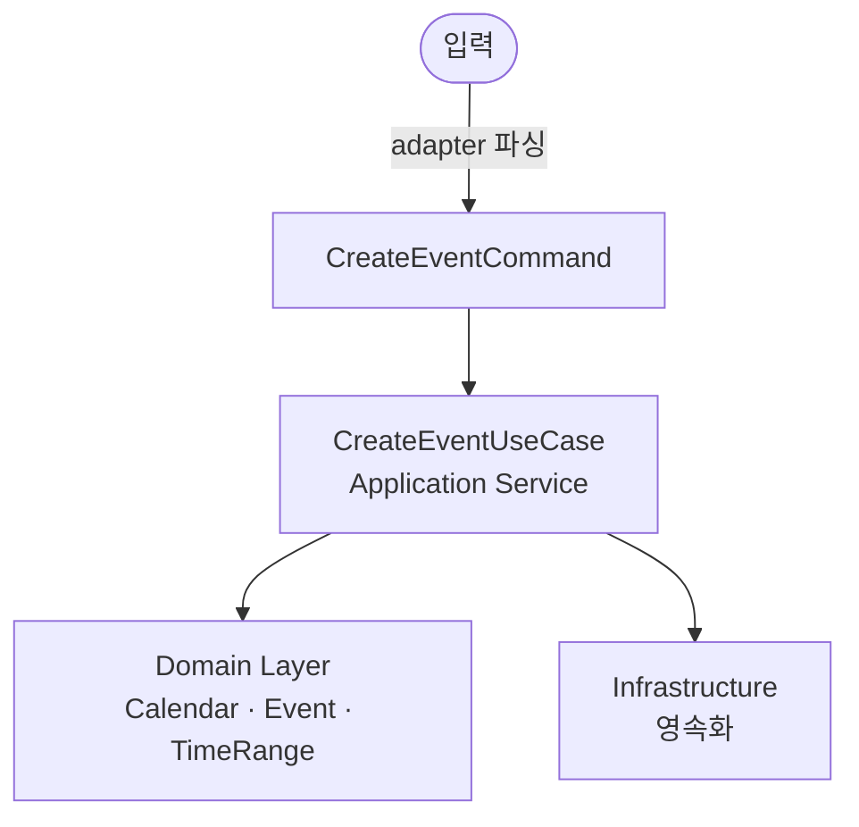

## 핵심

DDD는 "도메인(=업무 영역)을 소프트웨어 설계의 중심에 둔다"는 패러다임이다. 한 줄로 압축하면: **도메인 로직을 CLI/GUI/Voice/LLM/REST 어떤 인터페이스가 와도 변하지 않는 코어로 분리하고, 모든 계층이 같은 도메인 모델을 중심으로 정렬되게 한다.**

의도(intent) 단위 설계 — 외부 입력을 Command(의도) 객체로 바꿔 처리하는 방식 — 는 DDD의 **Application Service / Use Case** 계층과 같은 결이며, 각 인터페이스는 Adapter 역할을 맡는다.

## 1. DDD가 풀려는 문제

전통적인 CRUD 중심 설계는 데이터 구조(테이블/엔티티)를 먼저 만들고 그 위에 절차적 로직을 얹는다. 도메인이 복잡해질수록 다음 증상이 나타난다.

- 같은 개념을 코드/DB/사용자 문서에서 서로 다른 이름으로 부른다 (`event` vs `appointment` vs `meeting`)
- 비즈니스 규칙이 컨트롤러/서비스/SQL 사방에 흩어진다
- UI가 바뀌면 코어 로직까지 갈아엎어야 한다

DDD는 이를 **"도메인 모델을 명시적으로 코드 안에 표현하고, 모든 계층이 그 모델을 중심으로 정렬되도록 한다"**는 원칙으로 해결한다.

## 2. 네 가지 핵심 아이디어

아래는 일정/캘린더 도메인을 예시로 들어 설명한다(개념 설명용 예시일 뿐 DDD 자체는 도메인 무관).

### (a) Ubiquitous Language (유비쿼터스 언어)

도메인 전문가·개발자·코드·문서가 **같은 단어를 같은 뜻으로** 쓴다.

| 용어 | 의미 |
|------|------|
| `Event` | 시작·종료 시간이 정해진 한 건의 일정 |
| `TimeRange` | 시작~종료의 시간 구간 (start <= end 불변식) |
| `Calendar` | 한 사용자의 일정 묶음. Event들의 일관성 경계 |
| `Conflict` | 두 Event의 TimeRange가 겹치는 상태 |

이 어휘는 문서, 클래스명, 명령 이름, LLM 시스템 프롬프트 어디서나 동일하게 쓴다. `add-event`와 `create-appointment`가 섞이면 사용자/LLM 모두 혼란에 빠진다.

### (b) Domain Model Patterns (전술적 패턴)

Bounded Context 안에서 도메인을 모델링할 때 쓰는 빌딩 블록.

- **Entity** — 식별자(ID)로 구분되며 시간에 따라 상태가 변하는 객체. 예: `Event(id, title, timeRange)` — 제목/시간이 바뀌어도 같은 Event
- **Value Object (VO)** — 식별자 없이 **값 자체로 동일성**을 갖는 불변 객체. 예: `TimeRange(start, end)`. 생성 시 불변식 검증, 변경은 새 인스턴스 반환
- **Aggregate** — 일관성 경계. 외부는 **Aggregate Root**만 통해 접근. 예: `Calendar`가 자기 안의 `Event[]` 시간 충돌 규칙을 책임진다. 다른 Aggregate 간에는 ID 참조 + Domain Event로 연결
- **Repository** — Aggregate의 영속화 인터페이스. 도메인 코드는 SQL/파일을 모름
- **Domain Service** — 한 Entity/Aggregate에 자연스럽게 속하지 않는 도메인 로직
- **Domain Event** — "이런 일이 도메인에서 일어났다"는 사실. 예: `EventCreated`, `EventRescheduled`

### (c) Layer Separation (계층 분리)

1. **Presentation / Interface** — CLI 파서, GUI 컨트롤러, LLM 어댑터, REST 핸들러
2. **Application** — Use Case / Application Service. 트랜잭션 경계. 도메인 객체 조립
3. **Domain** — Entity, VO, Aggregate, Domain Service, Domain Event. **외부 의존성 0**
4. **Infrastructure** — Repository 구현, 외부 API, 알림 전송

Hexagonal Architecture 어휘로는 1+4가 **Adapter**, 2+3이 **Core** (Ports가 둘 사이 인터페이스).

### (d) Bounded Context (경계 컨텍스트)

큰 시스템이 되면 한 모델로 전체를 표현할 수 없다. 도메인을 여러 컨텍스트로 분할한다.<br>
각 컨텍스트는 같은 단어를 다르게 정의할 수 있다(예: Scheduling의 `Event`와 Notification의 `Event`는 다른 모델).<br>
컨텍스트 간 관계는 **Context Map**으로 명시한다 (Customer/Supplier, Anti-Corruption Layer 등).<br>
Bounded Context는 마이크로서비스 경계와 자주 일치하지만, 단일 모놀리스에도 그대로 적용된다.

## 3. 의도(Intent) 단위 설계 = Application Service

외부 입력을 Command 객체로 바꿔 Use Case에 넘기는 흐름:



각 노드의 상세:

- **CreateEventCommand** `{ calendarId, title, timeRange }`
- **CreateEventUseCase** (Application Service) 단계:
  1. Calendar 로드 (Repository)
  2. Event 생성 (도메인 객체)
  3. Calendar.addEvent(event) -- 충돌 검사 등 도메인 규칙은 Aggregate가 책임
  4. 저장 (Repository)
  5. EventCreated 도메인 이벤트 발행

핵심: **Use Case는 입력이 CLI에서 왔는지 LLM에서 왔는지 모른다.** Command 객체(=의도 객체)만 받는다.

## 4. 어댑터 = CLI / GUI / Voice / LLM

각 인터페이스의 책임은 "외부 입력 -> Command(의도) 객체 변환" 단 하나다.

- **CLI Adapter** — 토큰 파싱 -> Command
- **GUI Adapter** — 폼/버튼 이벤트 -> Command
- **Voice (STT) Adapter** — 음성 텍스트 -> (NLU/LLM) -> Command
- **LLM Function Calling Adapter** — LLM이 JSON Schema에 따라 직접 Command JSON 출력

LLM 어댑터가 특히 잘 맞는 이유: LLM Function Calling은 본질적으로 **"자연어를 구조화된 의도 객체로 변환"**하는 메커니즘이다. 코어가 이미 Command 객체를 받도록 설계되어 있으면, LLM 도구 스키마는 거의 그대로 Command 클래스의 미러가 된다.

## 5. 작은 프로젝트에 단계적으로 도입하기

작은 프로젝트에서 DDD를 100% 적용하면 오버엔지니어링이 된다. 시작 단계에서는 다음 순서가 합리적이다.

1. **Ubiquitous Language 확정** (가장 싸고 효과 큼)
2. **Domain Layer 분리** (핵심 Entity + VO + Aggregate만 먼저)
3. **Application Service (Use Case) 도입**
4. **Repository 인터페이스 도입** (구현은 일단 in-memory or 파일)
5. **첫 번째 Adapter 구현** (보통 가장 단순한 인터페이스부터)
6. **확장 시점에 추가 어댑터(LLM/Voice 등)** — 코어는 손대지 않는다
7. **Bounded Context 분할은 규모가 커진 뒤** (분리 신호가 보이면 그때)

## 예시 / 코드

### Value Object — TimeRange

```python
from dataclasses import dataclass
from datetime import datetime

@dataclass(frozen=True)
class TimeRange:
    start: datetime
    end: datetime

    def __post_init__(self):
        if self.start >= self.end:
            raise ValueError("TimeRange: start must be before end")

    def overlaps(self, other: "TimeRange") -> bool:
        return self.start < other.end and other.start < self.end

    def shift(self, delta) -> "TimeRange":
        return TimeRange(self.start + delta, self.end + delta)
```

- `frozen=True`로 불변, 생성 시 불변식 검증, 연산은 새 인스턴스 반환

### Entity — Event

```python
class Event:
    def __init__(self, event_id: str, title: str, time_range: TimeRange):
        self.id = event_id
        self.title = title
        self.time_range = time_range

    def reschedule(self, new_range: TimeRange) -> None:
        self.time_range = new_range  # Domain Event 발행 후보: EventRescheduled

    def __eq__(self, other):
        return isinstance(other, Event) and self.id == other.id
```

- 동일성은 `id`로만 판단

### Aggregate — Calendar

```python
class Calendar:
    def __init__(self, calendar_id: str, owner_id: str):
        self.id = calendar_id
        self.owner_id = owner_id
        self._events: list[Event] = []

    def add_event(self, event: Event) -> None:
        for existing in self._events:
            if existing.time_range.overlaps(event.time_range):
                raise ConflictError(f"Event conflicts with {existing.id}")
        self._events.append(event)
```

- 외부는 `Calendar`를 통해서만 `Event` 추가/제거. 충돌 규칙은 Aggregate Root가 책임

### Application Service — CreateEventUseCase

```python
@dataclass
class CreateEventCommand:
    calendar_id: str
    title: str
    start: datetime
    end: datetime

class CreateEventUseCase:
    def __init__(self, calendars: CalendarRepository, ids: EventIdGenerator):
        self.calendars = calendars
        self.ids = ids

    def execute(self, cmd: CreateEventCommand) -> str:
        calendar = self.calendars.find_by_id(cmd.calendar_id)
        event = Event(self.ids.next_id(), cmd.title, TimeRange(cmd.start, cmd.end))
        calendar.add_event(event)
        self.calendars.save(calendar)
        return event.id
```

- 트랜잭션 경계. CLI든 LLM이든 `CreateEventCommand`만 만들면 호출 가능

## 흔한 오해 / 반례

> **오해:** "DDD = 마이크로서비스"
> - Bounded Context가 마이크로서비스 경계와 자주 일치할 뿐이다.
>
> > **반례:** 단일 프로세스 모놀리스에도 적용된다.

> **오해:** "Aggregate = 큰 객체 트리"
> - Aggregate는 **일관성 경계**다.
> - 큰 트리는 안티패턴(성능·동시성 문제).
> - 작게 유지하고 다른 Aggregate와는 ID 참조 + Domain Event로 연결.

> **오해:** "Entity면 무조건 setter"
> - 도메인 의미가 있는 메서드(`reschedule`, `cancel`)로 노출한다.
> - 빈약한 도메인 모델(Anemic Domain Model) 회피.

> **오해:** "Value Object는 단순 DTO"
> - VO는 **불변식**과 **도메인 동작**을 가질 수 있다 (`TimeRange.overlaps()` 등).

> **오해:** "Repository = ORM Repository"
> - DDD Repository는 도메인 측 인터페이스다.
> - ORM 구현체가 우연히 같은 이름을 쓸 뿐이다.

> **오해:** "작은 프로젝트에 DDD를 다 적용하자"
> - 오버엔지니어링이다.
> - §5처럼 단계적으로 도입한다.

> **오해:** "의도 단위 설계는 DDD가 있어야만 가능"
> - DDD가 도메인 어휘·모델 정합성을 보장해주므로 같이 가면 자연스럽다.
>
> > **반례:** Hexagonal/Clean Architecture만으로도 가능하다.

## 참고 자료

- Eric Evans, *Domain-Driven Design: Tackling Complexity in the Heart of Software* (2003) — 원전
- Martin Fowler, "Domain Driven Design" — https://martinfowler.com/bliki/DomainDrivenDesign.html
- Martin Fowler, "Bounded Context" — https://www.martinfowler.com/bliki/BoundedContext.html
- "Domain-driven design" — https://en.wikipedia.org/wiki/Domain-driven_design
- Microsoft Learn, "Use Tactical DDD to Design Microservices" — https://learn.microsoft.com/en-us/azure/architecture/microservices/model/tactical-ddd
- Herberto Graca, "DDD, Hexagonal, Onion, Clean, CQRS — How I put it all together" — https://herbertograca.com/2017/11/16/explicit-architecture-01-ddd-hexagonal-onion-clean-cqrs-how-i-put-it-all-together/
- Vaadin, "DDD and the Hexagonal Architecture" — https://vaadin.com/blog/ddd-part-3-domain-driven-design-and-the-hexagonal-architecture
- Martin Fowler, "Function calling using LLMs" — https://www.martinfowler.com/articles/function-call-LLM.html
- Sairyss, "domain-driven-hexagon" (실전 코드) — https://github.com/Sairyss/domain-driven-hexagon
