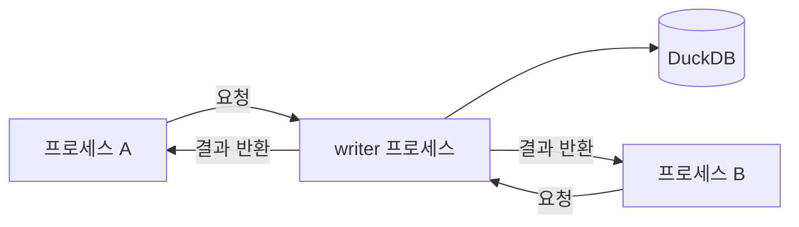

## 임베디드 DB 란

### 클라이언트-서버 DB 와의 차이

MySQL, PostgreSQL 은 별도 서버 프로세스가 항상 실행 중이고, 앱은 네트워크(소켓)로 연결해 쿼리를 보낸다.<br>
임베디드 DB 는 서버 프로세스가 없다. 라이브러리 형태로 앱 프로세스 안에서 직접 실행되며, 쿼리는 함수 호출로 처리된다.

### 공통 특징

- 서버 설치·관리 불필요 -- 라이브러리 링크만으로 동작
- 네트워크 레이어 없음 -- 함수 호출 직접 접근, 레이턴시 거의 0
- 단일 파일(또는 인메모리) -- DB 전체가 파일 하나, 복사가 곧 백업·이동
- 제로 설정 -- 서버 설정, 포트, 계정 관리 없음
- 낮은 리소스 -- 별도 프로세스가 없어 메모리·CPU 점유 최소

### 공통 한계

- 다중 프로세스 동시 쓰기에 제약 -- 여러 앱이 같은 DB 에 동시에 쓰는 구조에는 부적합
- 수평 확장 불가 -- 서버가 없으니 클러스터링·레플리케이션 없음
- 네트워크 접근 불가 -- 자체 네트워크 프로토콜이 없어 원격 머신에서 연결할 수 없음
  (libSQL, MotherDuck 같은 써드파티 래퍼가 있으나 임베디드 이점이 희석됨)

### 언제 임베디드가 맞는가

| 상황 | 선택 |
|------|------|
| 단일 프로세스, 단일 머신 | 임베디드 DB |
| 다중 프로세스, 단일 머신, 쓰기 경합 낮음 | SQLite (WAL 모드) 까지 가능 |
| 다중 머신, 또는 높은 동시 쓰기 | 클라이언트-서버 DB |
| 분석 쿼리, 단일 프로세스 | DuckDB |
| 분석 쿼리, 여러 서비스가 공유 | 클라이언트-서버 OLAP |

공유가 필요해지는 순간 임베디드의 이점이 사라지고 클라이언트-서버가 맞는 선택이 된다.

---

## SQLite -- 임베디드 OLTP

### 저장 구조: 행(row) 저장

한 레코드의 모든 컬럼 값이 디스크에 붙어서 저장된다.<br>
`WHERE id = 42` 처럼 특정 행 하나를 꺼내는 작업이 빠르다.<br>
반대로 `SELECT AVG(price) FROM orders` 처럼 수백만 행의 컬럼 하나만 훑는 작업은 읽을 필요 없는 나머지 컬럼까지 전부 I/O 한다.

### 실행 모델

행 단위 인터프리터. 행 하나를 꺼내 처리하고 다시 다음 행을 꺼내는 루프를 반복한다.<br>
함수 호출 오버헤드가 행마다 발생한다.

### 다중 프로세스 접근

SQLite 는 OS 파일 락 기반의 5단계 락을 사용한다.

```
UNLOCKED -> SHARED -> RESERVED -> PENDING -> EXCLUSIVE
```

- **SHARED**: 읽기 락. 여러 프로세스가 동시에 잡을 수 있다.
- **RESERVED**: "곧 쓸 예정" 신호. 하나만 가능하지만 기존 읽기는 유지된다.
- **EXCLUSIVE**: 실제 쓰기. 다른 모든 접근이 막힌다.

**WAL 모드** 를 켜면 쓰기는 WAL 파일에 먼저 기록되고 읽기는 메인 DB + WAL 을 합쳐 읽는다.<br>
결과적으로 writer 1개 + reader 여럿이 동시에 가능하다.

경쟁 상황 처리:

- `PRAGMA journal_mode=WAL` -- WAL 모드 활성화 (기본값 아님, 명시 설정 필요)
- `PRAGMA busy_timeout = 5000` -- 락이 풀릴 때까지 최대 5초 자동 대기
- `SQLITE_BUSY` 핸들링 -- 타임아웃 초과 시 에러, 재시도 로직 필요

주의: NFS 등 네트워크 파일시스템에서는 파일 락이 신뢰할 수 없어 SQLite 공식 문서도 명시적으로 경고한다.<br>
쓰기 트랜잭션은 짧게 유지할수록 경합이 줄어든다.

### 적합 사용 사례

- 모바일·데스크톱 앱의 로컬 데이터 저장 (단건 CRUD 위주)
- 설정·세션·캐시 등 소규모 구조적 데이터 보관
- 다수 클라이언트가 동시에 쓰는 경량 서버 (WAL 모드)
- 레코드 수 수십만 이하, 행 단위 접근이 대부분인 경우

---

## DuckDB -- 임베디드 OLAP

### 저장 구조: 열(column) 저장

같은 컬럼의 값들이 연속해서 저장된다.<br>
`SELECT AVG(price) FROM orders` 는 `price` 컬럼만 읽으면 되고 나머지 컬럼은 디스크에서 건드리지 않는다.<br>
같은 타입의 값이 연속 배치되므로 압축률도 크게 높아진다(예: 동일 문자열이 반복되면 FSST 등 경량 압축으로 크게 줄어듦).

### 실행 모델: 벡터화 실행(vectorized execution)

한 번에 2,048개 값(벡터)을 묶어 SIMD 연산으로 처리한다.<br>
CPU 캐시(L2/L3) 안에 워킹셋이 유지돼 캐시 미스가 줄고, 여러 CPU 코어를 자동으로 병렬 활용한다.

### 다중 프로세스 접근

기본적으로 파일을 열 때 독점 락을 건다. 다른 프로세스가 이미 열고 있으면 두 번째 프로세스는 에러로 실패한다.<br>
단, 모든 프로세스가 읽기 전용으로 열면 동시 접근이 허용된다.

다중 프로세스에서 쓰기가 필요한 경우 패턴:

- **폴링**: 락 파일로 주기적 확인.
  - 구현이 단순하지만 CPU 낭비와 반응 지연이 있다.
- **OS IPC (POSIX 세마포어 등)**: 통지 오버헤드가 거의 없고 대기 중 CPU 를 안 쓴다.
  - 비정상 종료 시 락 해제 처리가 필요하다.
- **단일 writer 프로세스 (권장)**: DuckDB 파일을 하나의 프로세스가 독점 소유하고, 다른 프로세스는 그쪽으로 쓰기 요청을 보내는 구조.
  - 소켓·메시지 큐 등 IPC 를 쓴다.



다중 프로세스 쓰기가 필요하다면 처음부터 "쓰기는 단일 진입점" 으로 설계하는 것이 가장 안정적이다.

### 적합 사용 사례

- 수백만~수억 행 테이블에서 집계·필터·조인을 수행하는 분석 쿼리
- CSV/Parquet/JSON 파일을 SQL 로 직접 쿼리하는 데이터 파이프라인
- Python pandas 대체 또는 보완 (in-process 로 DataFrame 없이 대용량 연산)
- 배치 ETL, 리포트 생성처럼 쓰기는 드물고 읽기가 무거운 워크로드

---

## SQLite vs DuckDB 비교

| 특성 | SQLite | DuckDB |
|------|--------|--------|
| 저장 단위 | 행(row) | 열(column) |
| 실행 모델 | 행 단위 인터프리터 | 벡터화 / 병렬 |
| 최적 워크로드 | OLTP -- 단건 조회·삽입·수정 | OLAP -- 대량 스캔·집계 |
| 트랜잭션 빈도 | 높은 빈도의 소규모 트랜잭션 | 낮은 빈도의 대규모 쿼리 |
| 다중 프로세스 쓰기 | WAL + busy_timeout 으로 직렬화 | 기본 불가, 전담 writer 프로세스 필요 |
| 다중 프로세스 읽기 | 항상 가능 | 읽기 전용 모드에서 가능 |
| bulk read 성능 | 느림 (불필요 컬럼도 I/O) | 빠름 (필요 컬럼만 I/O + 압축) |
| 단건 insert 성능 | 빠름 | 느림 |
| 앱단 조율 필요 | 설정 + 에러 핸들링 정도 | 다중 쓰기 시 IPC 또는 전담 프로세스 |

### 성능 차이의 규모

분석 벤치마크(Star Schema Benchmark)에서 DuckDB 가 SQLite 보다 30~50배 이상 빠른 경우가 있고, 반대로 고빈도 소규모 insert/update 에서는 SQLite 가 10~500배 빠르다.<br>
워크로드 방향이 반대여서 하나의 엔진이 둘 다 최적일 수 없다.

---

## 흔한 오해

> **오해:** "둘 다 파일 하나짜리 DB 니까 비슷하다"
> - 인터페이스(단일 파일, SQL, 서버 불필요)는 비슷하지만 저장 포맷과 실행 엔진이 근본적으로 다르다.
> - 같은 SQL 을 쓴다고 같은 성능이 나오지 않는다.

> **오해:** "DuckDB 가 더 빠르니까 SQLite 를 대체하면 된다"
> - DuckDB 는 단건 insert/update 가 많은 OLTP 에서 SQLite 보다 훨씬 느리다.
> - 특히 모바일·임베디드처럼 쓰기가 빈번하고 동시 접근이 있는 환경에서는 SQLite 가 맞다.

> **오해:** "bulk read 는 인덱스를 잘 만들면 SQLite 도 빠르다"
> - 인덱스는 행 기반 조회에 효과적이지만 대규모 집계에서는 열 저장 + 벡터화 실행의 구조적 이점을 따라가기 어렵다.
> - 특히 컬럼 수가 많고 그 중 일부만 집계하는 쿼리일수록 격차가 커진다.

> **오해:** "임베디드 DB 를 원격 서버에 두고 쓸 수 있다"
> - 자체 네트워크 프로토콜이 없어 기본적으로 불가능하다.
> - 써드파티 래퍼(libSQL, MotherDuck 등)가 있지만 임베디드의 이점이 희석된다.
> - 원격 접근이 필요하면 처음부터 클라이언트-서버 DB 를 쓰는 게 맞다.

---

## 미해결 질문

- DuckDB 가 단건 insert 에서 느린 이유가 열 저장 특성(컬럼 파일 업데이트 비용)인지, 잠금 모델 때문인지 -- 둘 다 관여하는지 확인 필요.
- DuckDB 의 기본 벡터 크기(2,048)가 설정으로 변경 가능한지 여부.

---

## 참고 자료

- [DuckDB: An Architectural Deep Dive into the In-Process OLAP Engine](https://thinhdanggroup.github.io/duckdb/)
- [DuckDB vs SQLite: Which Embedded Database Should You Use? -- MotherDuck](https://motherduck.com/learn/duckdb-vs-sqlite-databases/)
- [DuckDB vs SQLite: A Complete Database Comparison -- DataCamp](https://www.datacamp.com/blog/duckdb-vs-sqlite-complete-database-comparison)
- [Why DuckDB -- duckdb.org](https://duckdb.org/why_duckdb)
- [Columnar Databases: Column vs Row Storage Explained -- MotherDuck](https://motherduck.com/learn/columnar-storage-guide/)
- [DuckDB Internals: Vectorized Execution, Columnar Storage, and Query Processing -- Calmops](https://calmops.com/database/duckdb/duckdb-internals/)
