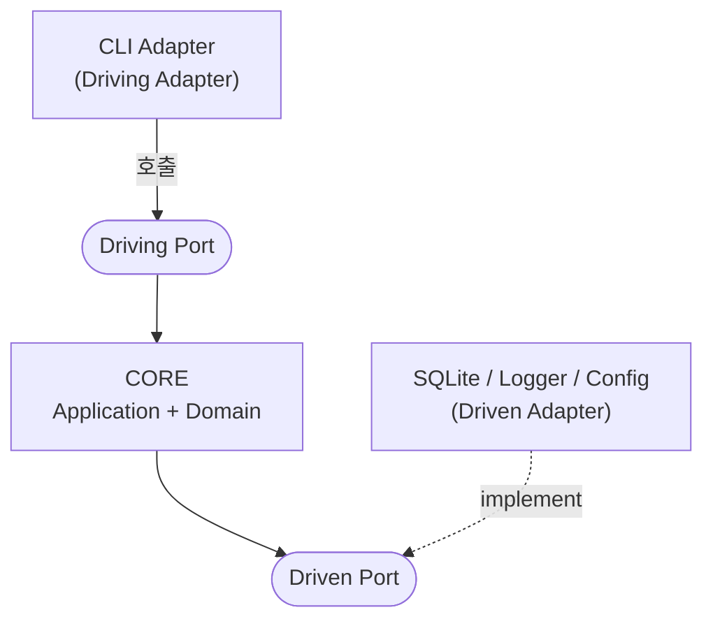

## 핵심

헥사고날 아키텍처는 "애플리케이션 코어(도메인 + 유스케이스)를 중앙에 두고, 바깥 세계(DB·CLI·GUI·LLM·로깅·설정)와의 모든 접점을 **인터페이스(Port)**로 추상화한 뒤, 그 인터페이스를 구현한 **어댑터(Adapter)**만 바깥에 둔다"는 구조다. Alistair Cockburn이 2005년 제안했고 별칭이 "Ports & Adapters"다. 한 줄 핵심:

> **코어는 바깥을 모른다. 바깥이 코어를 안다. 의존성은 항상 바깥 -> 안쪽(코어)으로만 흐른다.**

이 구조를 택하는 동기는 보통 하나다. 미래에 LLM/Voice/GUI 어댑터나 다른 DB를 추가/교체할 때 **코어 코드를 한 줄도 손대지 않기** 위함이다. DDD가 "도메인을 어떻게 모델링하나"라면, 헥사고날은 "그 도메인을 바깥 세계로부터 어떻게 격리하나"의 구조적 골격이다.

## 1. 헥사고날이 풀려는 문제 — "코어가 바깥에 오염된다"

전형적인 계층형(layered) 코드는 흔히 이렇게 흐른다.

```
Controller -> Service -> Repository(=SQL 직접) -> DB
```

이 구조의 함정은 화살표 방향이다. Service가 Repository 구현(SQLite, 파일, HTTP)을 **직접 알고 의존**한다. 그래서 다음이 벌어진다.

- 도메인 로직 안에 DB 호출이나 SQL 문자열이 스며든다
- CLI/입력 파싱 코드와 비즈니스 규칙이 한 함수에 섞인다
- DB를 다른 것으로 바꾸려면 도메인 코드까지 수정해야 한다
- 새 인터페이스(LLM, GUI)를 붙이려면 코어를 복사·분기해야 한다

헥사고날은 이를 **의존성 역전(Dependency Inversion)**으로 끊는다. 코어가 "나는 이런 능력이 필요하다"는 **인터페이스(Port)**만 선언하고, 그 인터페이스를 누가 어떻게 구현하는지는 모른다. 구현(Adapter)이 인터페이스에 맞춰 들어온다.

## 2. 세 가지 핵심 구성요소 — Port, Adapter, Core

아래는 일정 도메인(Event/Todo, TimeRange 등)을 예시로 든다.

### (a) Core (애플리케이션 코어 = 육각형 내부)

바깥 세계를 전혀 모르는 순수 영역. 두 층으로 나뉜다.

- **Domain** — Entity, Value Object, Aggregate, Domain Service. 순수 도메인 규칙. 예: `Event`/`Todo`(Entity), `TimeRange`(VO), `ConflictDetector`(Domain Service)
- **Application** — Use Case. 도메인 객체를 조립하고 Port를 호출해 한 시나리오를 완성. 트랜잭션 경계

핵심 규칙: **코어는 어떤 어댑터·외부 라이브러리(DB 드라이버, 로깅 라이브러리, CLI 파서 등)도 import 하지 않는다.** 코어가 import 하는 것은 자기 자신과 표준 라이브러리, 그리고 자기가 선언한 Port 인터페이스뿐이다.

### (b) Port (포트 = 육각형의 변)

코어와 바깥을 잇는 **인터페이스(추상 클래스 / 순수 가상 함수)**. "코어가 외부와 주고받는 약속"이다. 방향에 따라 둘로 나뉜다.

- **Driving Port (= Primary / Inbound Port)** — 바깥이 코어를 **호출하는** 입구. 보통 Use Case 인터페이스 그 자체. "이 애플리케이션으로 무엇을 할 수 있는가"의 목록
- **Driven Port (= Secondary / Outbound Port)** — 코어가 바깥에게 **요청하는** 출구. "코어가 살아가려면 외부에서 무엇이 필요한가"의 목록. 예: `Repository`, `Logger`, `ConfigLoader` 인터페이스

### (c) Adapter (어댑터)

Port라는 약속을 실제 기술로 구현하거나 호출하는 바깥쪽 코드. 역시 방향에 따라 둘.

- **Driving Adapter (= Primary Adapter)** — 외부 입력을 코어 호출로 변환. 사용자/외부가 시스템을 "운전(drive)"한다. 예: CLI 어댑터(인자 파싱 -> UseCase 호출)
- **Driven Adapter (= Secondary Adapter)** — 코어가 던진 Driven Port 요청을 실제 기술로 수행. 코어에 의해 "운전당한다(driven)". 예: SQLite로 Repository 구현, 로깅 라이브러리로 Logger 구현

## 3. 의존성 방향 — 이 그림 하나가 전부다



그림 읽는 법:

- **Driving Port** = UseCase 인터페이스
- **CORE** (Application + Domain) -- 외부 라이브러리 import 0
- **Driven Port** = Repository · Logger · ConfigLoader 인터페이스
- 점선(`implement`) -- Driven Adapter 가 코어의 Port 를 구현한다. 컴파일 의존성이 바깥에서 코어로 향함 = **의존성 역전**

화살표를 정확히 읽는 것이 핵심이다.

- **Driving 쪽**: 어댑터 -> 코어 (어댑터가 코어를 안다)
- **Driven 쪽**: 어댑터 -> 코어 (어댑터가 코어의 인터페이스를 **implement** 한다)

즉 **양쪽 모두 화살표가 코어를 향한다**. 코어에서 바깥으로 나가는 컴파일 타임 의존성은 0이다. 이것이 "의존성 역전"이라 불리는 이유다. 런타임에는 코어가 Repository를 호출하지만, 컴파일 타임에는 코어가 `Repository` **인터페이스**만 알 뿐 `SqliteRepository` **구현**은 모른다.

## 4. Composition Root — 단 한 곳만 모든 것을 안다

여기서 자연스러운 의문. "코어가 `SqliteRepository`를 모른다면, 도대체 누가 코어에게 그걸 쥐여주는가?"

답이 **Composition Root**다. 시스템에서 **딱 한 곳**, 모든 구체 구현을 알고 조립하는 지점. 보통 진입점(`main`)이 그 역할이다.

```cpp
int main(int argc, char** argv) {
    // 1. Driven Adapter 들을 구체 생성 (여기서만 외부 라이브러리를 안다)
    SqliteRepository repo("data.db");
    SpdLogger        logger;
    TomlConfigLoader config("config.toml");

    // 2. Driven Port(인터페이스)로서 코어에 주입 (생성자 주입)
    CreateEventUseCase  createEvent(repo, logger);
    ListTodosUseCase    listTodos(repo);
    // ... 나머지 UseCase 조립

    // 3. Driving Adapter 에 UseCase 들을 넘김
    CliApp app(createEvent, listTodos, /* ... */);

    // 4. 실행
    return app.run(argc, argv);
}
```

진입점의 책임은 "어떤 구현을 코어의 어떤 구멍에 꽂을지" 결정하는 **배선(wiring)**뿐이다. 비즈니스 로직은 한 줄도 없다. 이 한 곳만이 모든 외부 라이브러리를 동시에 안다. 나머지 어떤 모듈도 그것들을 동시에 알지 못한다.

> Composition Root가 "더럽다"(모든 구체를 안다)는 것은 의도된 설계다. 더러움을 시스템의 가장자리 한 점에 몰아넣어, 나머지 전부를 깨끗하게 유지하는 거래다.

## 5. 어댑터 확장 시나리오로 본 가치

헥사고날의 가치는 "미래 어댑터 추가/교체 시점의 무수정(無修正)"에서 분명해진다.

미래에 **LLM 어댑터**를 붙인다고 하자. 헥사고날이 아니라면 입력 파싱·비즈니스 로직이 얽혀 있어 코어를 갈아엎어야 한다. 헥사고날에서는:

1. 새 Driving Adapter(예: `adapter_llm`)를 만든다 (자연어 -> UseCase 호출 변환)
2. 기존 UseCase(= Driving Port)를 그대로 호출한다
3. 진입점(Composition Root)에서 새 어댑터를 배선에 추가한다
4. **코어와 기존 Driven Adapter들은 한 줄도 안 바뀐다**

DB를 다른 것으로 바꾸는 경우도 대칭이다. 새 Driven Adapter가 기존 `Repository` 인터페이스를 implement 하면 끝. 코어는 모른다.

이것이 "작은 도구인데 왜 이렇게까지 분리하나"에 대한 답이다. 지금의 단순함이 아니라 **미래 변경 시점의 비용**을 사는 트레이드오프다. 어댑터 추가/교체 계획이 없다면 오버엔지니어링이 될 수 있다.

## 6. 모듈 -> 헥사고날 역할 매핑 (일반형)

| 모듈 / 구성요소 | 헥사고날 역할 | 외부 라이브러리 |
|---------------|-------------|---------------|
| `domain` (Entity, VO, Domain Service) | Core - Domain | 없음 (순수) |
| `application` (UseCase) | Core - Application + **Driving Port** | 없음 (순수) |
| `ports` (`Repository`/`Logger`/`ConfigLoader` 인터페이스) | **Driven Port** (코어가 선언) | 없음 (선언만) |
| `adapter_cli` | **Driving Adapter** | CLI 파서, UI 라이브러리 |
| `adapter_sqlite` (Repository 구현) | **Driven Adapter** | DB 드라이버 |
| `adapter_logger` / `adapter_config` | **Driven Adapter** | 로깅 / 설정 라이브러리 |
| 진입점(`main`) | **Composition Root** | 위 전부를 알고 배선 |

읽는 법:

- "없음(순수)" 행이 곧 **import 금지 규칙의 대상**이다. 이 모듈들에서 외부 라이브러리가 등장하면 헥사고날 위반이다.
- `ports`는 코어가 선언하지만 구현은 어댑터에 있다 = 의존성 역전의 물리적 증거.
- 진입점만이 "외부 라이브러리" 칸이 가득 찬 유일한 행이다.

## 예시 / 코드

### Driven Port 선언 (코어 안 — ports/)

```cpp
// ports/repository.hpp  --- 코어가 "이런 영속화 능력이 필요하다"고 선언
#include <optional>
#include <vector>

class Repository {       // 순수 인터페이스, 외부 라이브러리 import 0
public:
    virtual ~Repository() = default;
    virtual void                 save(const Event& e)            = 0;
    virtual std::optional<Event> findById(const EventId& id)     = 0;
    virtual std::vector<Event>   findInRange(const TimeRange& r) = 0;
};
```

### Driven Adapter 구현 (바깥 — adapter_sqlite/)

```cpp
// adapter_sqlite/sqlite_repository.hpp --- Port 를 실제 DB 라이브러리로 구현
#include "ports/repository.hpp"
#include <SQLiteCpp/SQLiteCpp.h>   // 외부 의존성은 어댑터 안에만 갇힌다

class SqliteRepository : public Repository {   // Port 를 implement
public:
    explicit SqliteRepository(const std::string& dbPath);
    void                 save(const Event& e) override;
    std::optional<Event> findById(const EventId& id) override;
    std::vector<Event>   findInRange(const TimeRange& r) override;
private:
    SQLite::Database db_;
};
```

### Use Case 가 Port 만 의존 (코어 안 — application/)

```cpp
// application/create_event_usecase.hpp
#include "ports/repository.hpp"
#include "ports/logger.hpp"

class CreateEventUseCase {           // Driving Port 역할도 겸함
public:
    CreateEventUseCase(Repository& repo, Logger& log)  // 인터페이스만 받는다
        : repo_(repo), log_(log) {}

    EventId execute(const CreateEventCommand& cmd) {
        TimeRange range{cmd.start, cmd.end};       // VO 불변식 검증
        Event ev{EventId::generate(), cmd.title, range};
        // ConflictDetector 등 도메인 규칙 적용 ...
        repo_.save(ev);                            // 구현이 SQLite인지 모름
        log_.info("event created");               // 구현이 무엇인지 모름
        return ev.id();
    }
private:
    Repository& repo_;   // SqliteRepository 가 아니라 Repository
    Logger&     log_;
};
```

세 코드 조각의 의미: `application`은 `adapter_sqlite`를 #include 하지 않는다. 오직 `ports/repository.hpp`만 안다. 둘의 연결은 진입점의 생성자 주입에서만 일어난다.

## 흔한 오해 / 반례

> **오해:** "헥사고날 = 3계층(controller/service/repository)의 다른 이름"
> - 3계층은 의존성이 위 -> 아래 단방향이다(service가 repository 구현을 안다).
> - 헥사고날의 본질은 **의존성 역전**으로, repository 구현이 코어 인터페이스를 implement 한다(바깥 -> 안).
> - 화살표 방향이 정반대다.

> **오해:** "육각형이라 변이 6개여서 의미가 있다"
> - 6은 그냥 "여러 개의 포트를 그릴 공간"의 상징일 뿐, 포트 개수와 무관하다.
> - Cockburn도 숫자에 의미가 없다고 명시했다.

> **오해:** "Port와 Adapter는 1:1"
> - 하나의 Driven Port(`Repository`)를 SQLite·in-memory·JSON 어댑터가 각각 구현할 수 있다(테스트용 가짜 포함).
> - 하나의 Driving Port(UseCase)를 CLI·LLM·GUI 어댑터가 동시에 호출할 수 있다.
>
> > **반례:** N:1이 정상이다.

> **오해:** "코어가 Repository를 호출하니 코어가 DB를 아는 것 아니냐"
> - 런타임 호출과 컴파일 타임 의존성을 혼동한 것이다.
> - 코어는 `Repository` **인터페이스**만 컴파일 타임에 알고, 실제 `SqliteRepository` 인스턴스는 런타임에 주입받아 호출할 뿐 그 타입을 모른다.

> **오해:** "Driving/Driven은 입력/출력과 같다"
> - 대체로 맞지만 정확히는 **"누가 누구를 호출하느냐(제어 흐름의 방향)"** 기준이다.
> - Driving = 바깥이 코어를 호출(코어가 수동).
> - Driven = 코어가 바깥을 호출(코어가 능동).
> - 데이터 방향이 아니라 제어 방향이다.

> **오해:** "Composition Root가 비대해지면 설계가 잘못된 것"
> - 진입점이 모든 구체를 알고 배선이 길어지는 것은 **정상이고 의도된 것**이다.
> - 더러움을 한 점에 모으는 것이 목적이다.
> - 다만 배선 로직에 if/비즈니스 분기가 섞이면 그건 문제다.

> **오해:** "헥사고날을 쓰면 DDD를 안 써도 된다 / 써야만 된다"
> - 직교 관계다.
> - 헥사고날은 "바깥과의 격리 구조", DDD는 "도메인 모델링 방법"이다.
> - 코어 내부(domain)를 DDD로 채우면 둘이 자연스럽게 맞물리지만 강제는 아니다.

> **오해:** "작은 로컬 도구엔 과하다"
> - 단기적으로는 맞는 지적이다.
> - 정당화 근거는 오직 미래 어댑터 확장/교체다.
> - 그 계획이 없다면 오버엔지니어링이 될 수 있음을 인지하고 채택하는 트레이드오프다.

## 참고 자료

- Netflix Tech Blog, "Ready for changes with Hexagonal Architecture" — https://netflixtechblog.com/ready-for-changes-with-hexagonal-architecture-b315ec967749 (실전 적용 사례)
- Herberto Graca, "DDD, Hexagonal, Onion, Clean, CQRS — How I put it all together" — https://herbertograca.com/2017/11/16/explicit-architecture-01-ddd-hexagonal-onion-clean-cqrs-how-i-put-it-all-together/
- Vaadin, "DDD and the Hexagonal Architecture" — https://vaadin.com/blog/ddd-part-3-domain-driven-design-and-the-hexagonal-architecture
- Martin Fowler, "Inversion of Control Containers and the Dependency Injection pattern" — https://martinfowler.com/articles/injection.html
- Mark Seemann, "Composition Root" — https://blog.ploeh.dk/2011/07/28/CompositionRoot/
- Robert C. Martin, "The Clean Architecture" — https://blog.cleancoder.com/uncle-bob/2012/08/13/the-clean-architecture.html (동심원 변형, 같은 의존성 규칙)
- "Hexagonal architecture (software)" — https://en.wikipedia.org/wiki/Hexagonal_architecture_(software) (Cockburn 2005 원전 귀속 포함)
